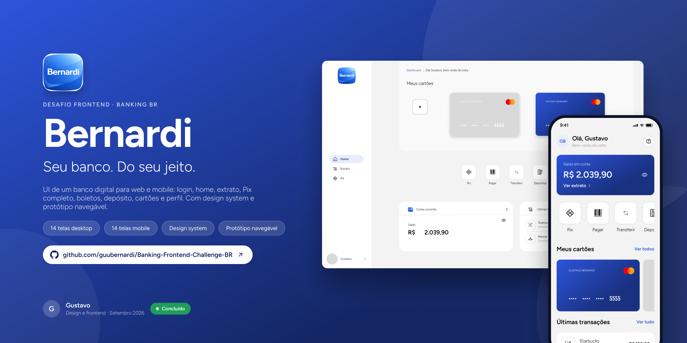
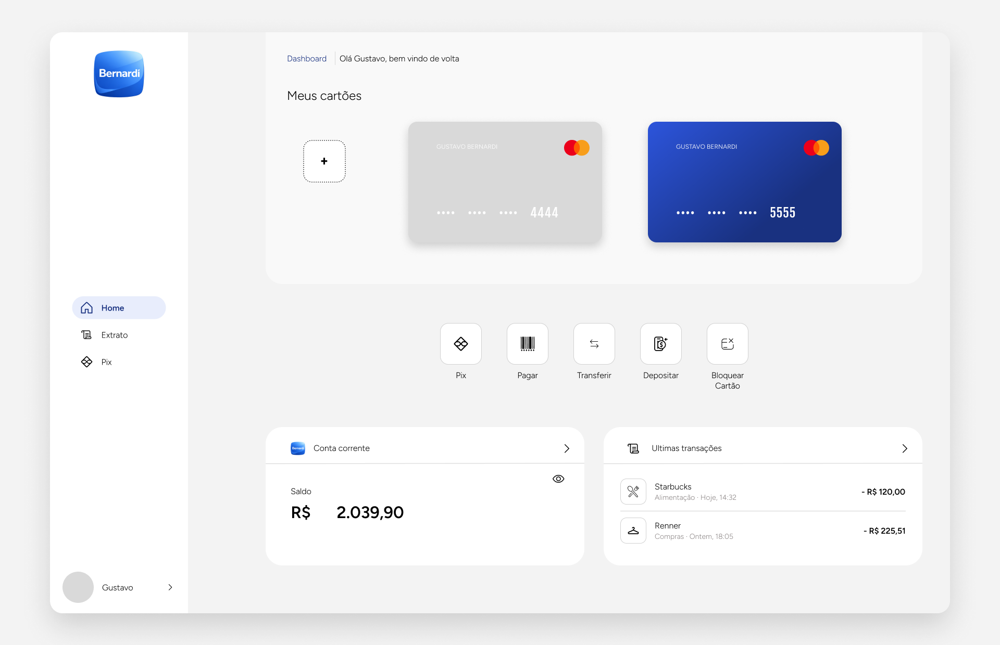
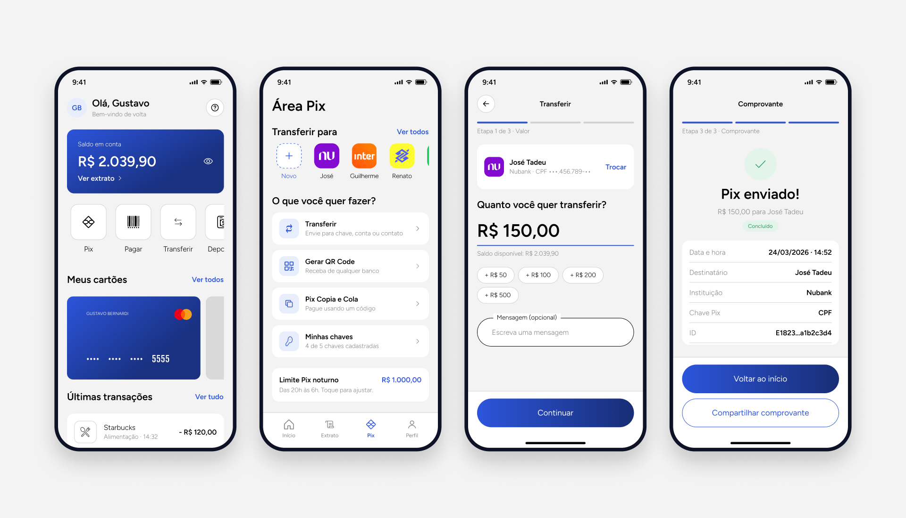

<div align="center">



# Banking Frontend Challenge BR

**Desafio front-end bancário em português, com layout completo no Figma, para você construir um projeto de portfólio com cara de produto real.**

Inspirado em Nubank, Itaú, Inter, C6 Bank, PicPay e Mercado Pago.

[](https://www.figma.com/design/eSQ2IVa6l7GrcpTSHO77RD/Banking-Frontend-Challenge-BR?node-id=0-1)
[](https://github.com/guubernardi/Banking-Frontend-Challenge-BR/stargazers)
[](https://github.com/guubernardi/Banking-Frontend-Challenge-BR/issues?q=label%3Asolucao)
[](CONTRIBUTING.md)

[Ver o Figma](https://www.figma.com/design/eSQ2IVa6l7GrcpTSHO77RD/Banking-Frontend-Challenge-BR?node-id=0-1) · [Enviar minha solução](https://github.com/guubernardi/Banking-Frontend-Challenge-BR/issues/new?template=enviar-solucao.yml) · [English](#-english)

</div>

---

## 🚀 Comece em 4 passos

1. **Dê uma ⭐ neste repositório** para salvar o desafio e acompanhar as novidades
2. **Abra o [layout no Figma](https://www.figma.com/design/eSQ2IVa6l7GrcpTSHO77RD/Banking-Frontend-Challenge-BR?node-id=0-1)** e explore as telas, os componentes e o protótipo navegável
3. **Construa** com a stack que quiser, seguindo os requisitos abaixo
4. **[Envie sua solução](https://github.com/guubernardi/Banking-Frontend-Challenge-BR/issues/new?template=enviar-solucao.yml)** e apareça no [mural da comunidade](#-mural-da-comunidade)

---

## 📌 Sobre o desafio

O **Banking Frontend Challenge BR** é um desafio técnico de front-end criado para desenvolvedores brasileiros que querem construir um projeto de portfólio sólido e próximo de um produto real.

A proposta vai além de uma tela bonita: você vai simular fluxos completos de um app bancário/fintech, lidando com estados reais de interface, acessibilidade, responsividade e componentização.

---

## 🖼️ O que você vai construir





O Figma traz **28 telas** (14 desktop e 14 mobile), um **design system** com tokens e componentes e um **protótipo navegável**:

| Área | Telas |
|---|---|
| **Acesso** | Login |
| **Início** | Home, Extrato, Perfil |
| **Pix** | Área Pix, Valor, Confirmação, Comprovante, Gerar QR Code, Minhas chaves |
| **Ações** | Pagar boleto, Depositar, Cartões, Confirmar bloqueio do cartão |

---

## 🎯 Para quem é?

- Devs front-end **iniciantes** que querem um projeto forte no portfólio
- Pessoas **estudando para vagas** em bancos, fintechs e squads de produto
- Quem quer praticar interfaces inspiradas em **Nubank, Itaú, Inter e C6**
- Quem deseja evoluir em **UX, UI e estruturação de aplicações reais**

---

## 🧭 Escolha seu nível

Não precisa fazer tudo de uma vez. Comece pelo seu nível e vá subindo.

| Nível | O que entregar |
|---|---|
| 🟢 **Iniciante** | Login, Home e Extrato, responsivos, com dados mockados em JSON |
| 🟡 **Intermediário** | Tudo do iniciante + fluxo Pix completo (valor, confirmação, comprovante) com estados de loading, erro e vazio |
| 🔴 **Avançado** | Todas as telas + requisitos bônus, testes, acessibilidade WCAG AA e deploy |

---

## 🖥️ Telas e fluxos esperados

| Tela | Descrição |
|---|---|
| **Login** | CPF/e-mail, senha, feedback de erro, loading |
| **Dashboard** | Saldo, atalhos, resumo do cartão, últimas transações |
| **Extrato** | Listagem, filtros por período, busca, agrupamento |
| **Comprovante** | Dados da transação, status, compartilhar/baixar |
| **Pix** | Fluxo completo: chave, valor, revisão, confirmação e sucesso/erro |

---

## ✅ Requisitos obrigatórios

- [ ] Tela de login com validação e estado de carregamento
- [ ] Dashboard com saldo (mostrar/ocultar), atalhos e últimas transações
- [ ] Extrato com filtro por período e busca por texto
- [ ] Comprovante com todos os dados da transação
- [ ] Fluxo Pix completo (mínimo 3 etapas)
- [ ] Estados de loading, erro e vazio em pelo menos 2 telas
- [ ] Responsividade: mobile, tablet e desktop
- [ ] Dados mockados em JSON

---

## ⭐ Requisitos bônus

- [ ] Animações e microinterações
- [ ] Tema escuro/claro
- [ ] Skeleton loading
- [ ] Open Finance (bancos conectados)
- [ ] Acessibilidade completa (WCAG AA)
- [ ] Teclado numérico fake no Pix
- [ ] PWA básico
- [ ] Internacionalização (pt-BR / en)

---

## 📊 O que será avaliado

### Interface
- Hierarquia visual
- Consistência entre componentes
- Qualidade visual geral
- Atenção aos detalhes

### Experiência do usuário
- Clareza de navegação
- Feedback visual
- Usabilidade
- Fluidez da interface

### Código
- Componentização
- Organização de pastas
- Legibilidade e reaproveitamento
- Boas práticas

### Responsividade
- Mobile-first
- Adaptação coerente para tablet e desktop (não apenas redimensionamento)

### Acessibilidade
- Navegação por teclado
- Foco visível
- Contraste adequado
- Semântica HTML
- Labels e atributos ARIA

### Maturidade de produto
- Loading states
- Empty states
- Error states
- Success states
- Validações de formulário

---

## 🗂️ Estrutura sugerida

```
src/
  components/      # componentes reutilizáveis
  pages/           # telas da aplicação
  layouts/         # estruturas de layout
  services/        # chamadas e lógica de dados
  mocks/           # dados fake em JSON
  assets/          # imagens, ícones, fontes
  styles/          # estilos globais e tokens
  utils/           # funções auxiliares
```

### Dados mockados sugeridos

```
mocks/
  user.json
  accounts.json
  transactions.json
  receipts.json
  pix-contacts.json
  connected-banks.json
```

---

## 🛠️ Stack

A escolha da stack é **livre**. Algumas sugestões:

**Frameworks:**
- React + Next.js
- Vue + Nuxt
- Angular
- Vite + React
- HTML, CSS e JavaScript puro

**Extras válidos:**
- TypeScript
- Tailwind CSS / Sass
- Zustand / Pinia / Context API
- shadcn/ui
- Framer Motion / VueUse

---

## 🎨 Layout de referência (Figma)

> 🔗 **[Acessar o Figma →](https://www.figma.com/design/eSQ2IVa6l7GrcpTSHO77RD/Banking-Frontend-Challenge-BR?node-id=0-1)**

O arquivo tem três páginas:

- **Capa:** visão geral do projeto
- **Telas:** 14 telas desktop e 14 mobile, separadas em seções (principais, fluxo Pix e ações), com protótipo navegável (use o botão ▶ Present)
- **Componentes:** design system com cores, raios e espaçamentos em variáveis, estilos de texto, ícones e componentes (botão, campo, cartão, item de transação, sidebar, tab bar e mais)

O Figma funciona como **guia de estrutura e fluxo**, não como cópia obrigatória. Soluções autorais são bem-vindas, desde que respeitem os fluxos principais e a proposta bancária do desafio.

**Tamanhos de frame utilizados:**
- Mobile: `390 × 844`
- Desktop: `1728 × 1117`
- Tablet: livre, adapte a partir do mobile e do desktop

**Tokens principais:**

| Token | Valor |
|---|---|
| Primária | `#2D55DC` |
| Primária escura | `#193180` |
| Fundo | `#F3F3F3` |
| Texto suave | `#8C8686` |
| Sucesso / Perigo | `#1E9E5A` / `#D93636` |
| Fontes | Figtree (interface) e Fjalla One (números do cartão) |

---

## 📐 Responsividade

O projeto deve ser desenvolvido com abordagem **mobile-first**, mas precisa funcionar bem em todas as telas.

A versão desktop **não deve ser apenas uma ampliação do mobile**, e sim uma adaptação coerente ao espaço disponível:

| Dispositivo | Adaptação esperada |
|---|---|
| Mobile | Navegação inferior, blocos empilhados |
| Tablet | Grid mais espaçado, filtros laterais ou em linha |
| Desktop | Sidebar fixa, áreas paralelas, melhor aproveitamento de espaço |

---

## 🏆 Como se destacar

Projetos que se destacam normalmente apresentam:

- ✅ Boa componentização e reaproveitamento de código
- ✅ Consistência visual entre todas as telas
- ✅ Estados completos (loading, erro, vazio, sucesso)
- ✅ Responsividade real, não apenas redimensionamento
- ✅ Atenção genuína à acessibilidade
- ✅ README bem feito com prints ou GIFs
- ✅ Deploy funcionando

---

## 📦 Como entregar

1. Suba o código no **GitHub** com README organizado
2. Adicione **prints ou GIFs** das principais telas
3. Faça o **deploy** em Vercel, Netlify ou similar
4. Adicione o tópico `banking-frontend-challenge-br` no seu repositório
5. **[Envie sua solução](https://github.com/guubernardi/Banking-Frontend-Challenge-BR/issues/new?template=enviar-solucao.yml)** para entrar no mural

---

## 🌟 Mural da comunidade

Soluções enviadas pela comunidade. Quer aparecer aqui? [Envie a sua](https://github.com/guubernardi/Banking-Frontend-Challenge-BR/issues/new?template=enviar-solucao.yml).

| Dev | Stack | Repositório | Deploy |
|---|---|---|---|
| *Seja a primeira pessoa a aparecer aqui* 👀 | | | |

Você também pode ver todas as soluções pelo tópico [`banking-frontend-challenge-br`](https://github.com/topics/banking-frontend-challenge-br).

---

## 💼 Por que esse projeto ajuda no portfólio?

Esse desafio demonstra que você sabe:

- Construir interfaces complexas com múltiplos estados
- Pensar em produto, não só em visual
- Lidar com fluxos reais de uma aplicação financeira
- Trabalhar acessibilidade de forma prática
- Organizar código front-end de forma escalável
- Criar experiências próximas do que o mercado espera

---

## 🤝 Contribuindo

Ideias de novas telas, melhorias no README, correções no layout e traduções são bem-vindas. Veja o [guia de contribuição](CONTRIBUTING.md).

---

## 🇺🇸 English

**Banking Frontend Challenge BR** is a free front-end challenge inspired by Brazilian digital banks (Nubank, Itaú, Inter, C6 Bank, PicPay, Mercado Pago). It ships with a complete [Figma layout](https://www.figma.com/design/eSQ2IVa6l7GrcpTSHO77RD/Banking-Frontend-Challenge-BR?node-id=0-1): 28 screens (desktop and mobile), a design system with tokens and components, and a clickable prototype. Build it with any stack, cover loading/error/empty states, accessibility and responsiveness, then [submit your solution](https://github.com/guubernardi/Banking-Frontend-Challenge-BR/issues/new?template=enviar-solucao.yml) to be featured. The content is in Portuguese, but the flows (login, dashboard, statement, Pix instant payments, bill payment, cards) are universal.

---

## ⚠️ Aviso legal

Este projeto é um desafio educacional e conceitual.
Não possui vínculo oficial com Itaú, Nubank, Inter, C6 Bank, PicPay, Mercado Pago ou qualquer outra instituição financeira.

Recomendamos fortemente que você crie sua própria marca: invente um nome de banco, crie um logo, defina uma paleta de cores e construa uma identidade visual autoral. Esse desafio não é só sobre código, é sobre pensar como um engenheiro de software que entende de produto. Quem vai além do técnico e demonstra visão de produto se destaca no mercado.

---

## 📄 Licença

Livre para uso **educacional e de portfólio**.

---

## ✍️ Autor

Criado por **Gustavo Bernardi, [@guubernardi](https://github.com/guubernardi)**

Se esse desafio te ajudou, deixa uma ⭐ no repositório. Isso ajuda mais devs a encontrarem o projeto.

---

*Inspirado em boas práticas de produto financeiro digital do ecossistema brasileiro.*
